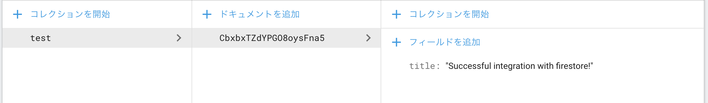

# flutter_googlemap_firestore

## Description
View Google's worldwide office locations using GoogleMap on iOS and Android.
If you get an API key, you can also link with Firestore.

## Language
- Android: Kotlin
- iOS: Swift

## Requirements
Flutter 1.0 SDK

## Getting Started
- Get API Key from https://cloud.google.com/apis/
- Clone the project [git clone https://github.com/soushu/flutter_googlemap_firestore.git]
- Insert API KEY in Android Manifest & App Delegate (iOS)
- Perform initial setup to use Firestore in the Firebase console. https://console.firebase.google.com/
- For Android, place google-services.json under app/src.
- For iOS, place GoogleService-Info.plist under Runner.
- Create a document 'test' in firestore.
- Build & Run the project
- If the string 'Successful integration with firestore!' is stored in the column 'title', the integration is successful.
